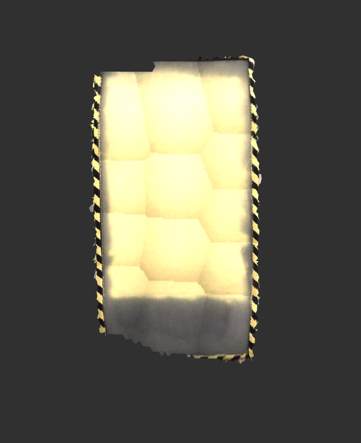

# Colorized Mesh Display

An RViz plugin for visualizing a mesh with per-vertex shading.

## Description

This display subscribes to messages of type `ColorizedMeshStamped`, provided
by this package. The `ColorizedMesh` message is similar to the `shape_msgs/Mesh`
message but includes arrays for vertex normals and vertex colors.

## Use-case Examples

### Visualization of heat map data

### Projection of color images onto a mesh

